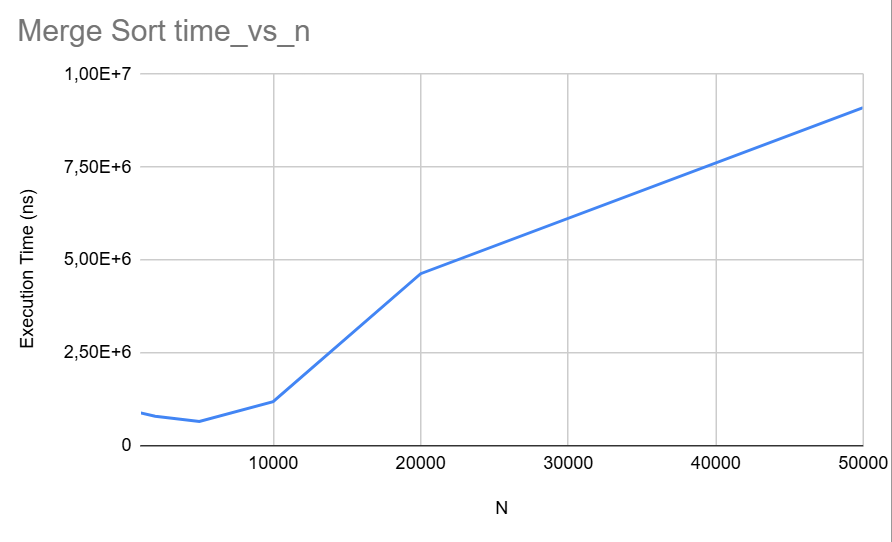
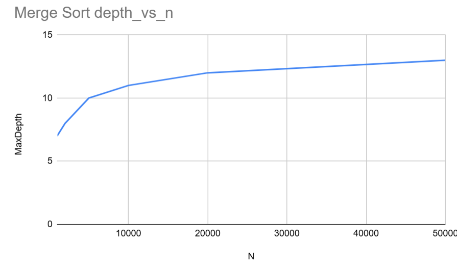

# Design# Assignment 1: Divide-and-Conquer Algorithms

## Architecture Notes

In this implementation, control over recursion depth and memory allocations was a primary consideration.

- **Recursion Depth:** For QuickSort, a robust strategy was implemented to guarantee O(log n) stack depth. This is achieved by handling the larger partition iteratively within a `while` loop and only making a recursive call for the smaller partition. This technique, known as "smaller-first recursion", prevents stack overflow errors on large or adversarial inputs. For MergeSort, the depth is naturally balanced and corresponds to O(log n).

- **Memory Allocations:** For MergeSort, a significant optimization was to pre-allocate a single `buffer` array. This buffer is then passed down through all recursive calls. This avoids the costly overhead of creating new temporary arrays at each merge step, drastically reducing memory churn and improving performance by minimizing garbage collection pauses.

---

## Recurrence Analysis

### 1. MergeSort

- **Recurrence Relation:** The algorithm divides the array of size `n` into two halves of size `n/2`, recursively sorts them, and then merges the results in linear time `O(n)`. This gives the recurrence:
  `T(n) = 2T(n/2) + Θ(n)`
- **Analysis Method:** This recurrence fits Case 2 of the Master Theorem. Here, `a=2`, `b=2`, and `f(n) = n`. We compare `f(n)` with `n^(log_b a) = n^(log_2 2) = n^1`. Since `f(n) = Θ(n^(log_b a))`, the theorem applies.
- **Result:** The overall time complexity is `Θ(n log n)`.

### 2. QuickSort (Randomized)

- **Recurrence Relation (Expected Case):** With a randomized pivot, we expect the partition to be reasonably balanced. In the average case, the partition splits the array into two subarrays of size approximately `n/2`. The partitioning step takes `O(n)`. The recurrence is:
  `T(n) = 2T(n/2) + Θ(n)` (This looks like MergeSort, but it's an expectation).
- **Analysis Method:** The analysis is similar to MergeSort, leading to an expected complexity. The worst-case `T(n) = T(n-1) + Θ(n)` which results in `O(n^2)` occurs with vanishingly small probability due to random pivot selection.
- **Result:** The expected time complexity is `Θ(n log n)`.

### 3. Deterministic Select (Median of Medians)

- **Recurrence Relation:** This algorithm is more complex. It divides `n` elements into groups of 5, finds their medians (`n/5` medians), and recursively calls itself to find the median of these medians (`T(n/5)`). The partitioning step guarantees that the next recursive call will be on at most `7n/10` elements. The work to find medians of small groups and partition is linear `O(n)`. This gives:
  `T(n) ≤ T(n/5) + T(7n/10) + Θ(n)`
- **Analysis Method:** This recurrence does not fit the Master Theorem. However, we can use Akra-Bazzi intuition or a substitution proof. We can show that `n/5 + 7n/10 = 9n/10 < n`, which means the work at each level of recursion decreases geometrically. The total work is dominated by the linear work at the root.
- **Result:** The time complexity is `Θ(n)`.

### 4. Closest Pair of Points

- **Recurrence Relation:** The algorithm sorts points by x-coordinate once (`O(n log n)` preprocessing). Then, it divides the set of `n` points into two halves of `n/2`, recursively finds the closest pair in each half, and performs a "strip check" in `O(n)` time. The recurrence for the recursive part is:
  `T(n) = 2T(n/2) + O(n)`
- **Analysis Method:** This is again Case 2 of the Master Theorem, identical to MergeSort.
- **Result:** The overall time complexity, including the initial sort, is `Θ(n log n)`.

---

## Initial Plots and Discussion

Here, we will present plots for:
1.  **Time vs. n** for MergeSort and QuickSort.
2.  **Recursion Depth vs. n** for MergeSort and QuickSort.

We expect to see that both algorithms exhibit `O(n log n)` growth in time. We will discuss any observed differences in constant factors (e.g., QuickSort being faster in practice due to better cache locality) and verify that the recursion depth for both grows logarithmically, as predicted._of_Algorithms_Assignment1